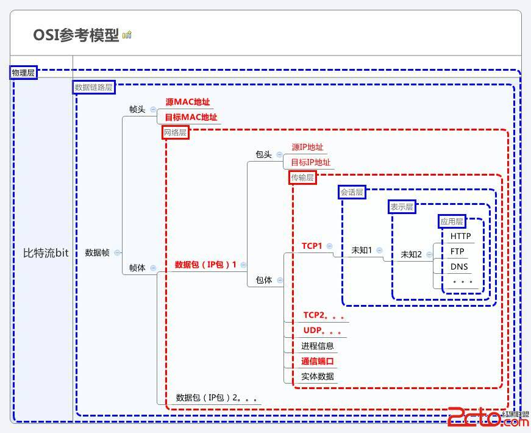

### 需要总结的点
+ 每一层的功能分工
+ 每一层的协议
+ 每一层的设备
+ 每一层的数据结构
+ OSI和TCP/IP怎么个对应法

### 参考
0. [OSI七层模式简单通俗理解][10]
6. [ISO-OSI的七层协议经典架构][7]
7. [OSI七层模型详解][8]
0. [不再困惑 互联网OSI七层模型全解析][0]
1. [OSI七层模型详解][1]
2. [ISO/ OSI七层模型结构体系][2]
3. [计算机网络基础之OSI七层参考模型][3]
4. [TCP/IP协议（七层、四层协议）][4]
5. [TCP/IP数据包结构详解][5]
6. [HTTP头信息解读][6]
7. [OSI七层与TCP/IP五层网络架构详解][9]

[0]: http://tech.sina.com.cn/h/2009-07-16/0540986384.shtml "不再困惑 互联网OSI七层模型全解析"
[1]: http://www.cnblogs.com/songQQ/archive/2009/12/02/1615200.html "OSI七层模型详解"
[2]: http://www.3lian.com/edu/2012/03-07/22620.html "ISO/ OSI七层模型结构体系"
[3]: http://blog.csdn.net/eflyq/article/details/10050829 " 计算机网络基础之OSI七层参考模型"
[4]: http://webnoties.blog.163.com/blog/static/18352514120135271176392/ "TCP/IP协议（七层、四层协议）"
[5]: http://blog.csdn.net/prsniper/article/details/6762145 "TCP/IP数据包结构详解"
[6]: http://www.admin10000.com/document/2407.html "HTTP头信息解读"
[7]: http://www.cnblogs.com/ios8/p/ios-osi.html "ISO-OSI的七层协议经典架构"
[8]: http://blog.csdn.net/yaopeng_2005/article/details/7064869 "OSI七层模型详解"
[9]: http://network.chinabyte.com/465/12756465.shtml "OSI七层与TCP/IP五层网络架构详解"
[10]: http://www.2cto.com/net/201309/247111.html "OSI七层模式简单通俗理解"